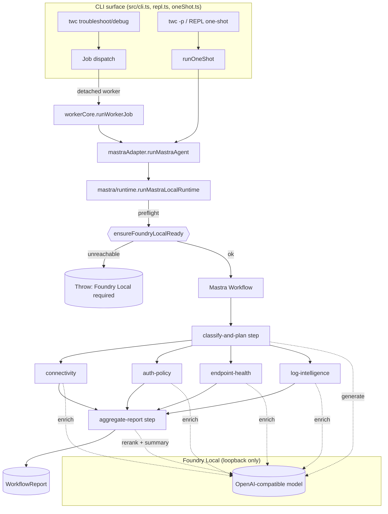
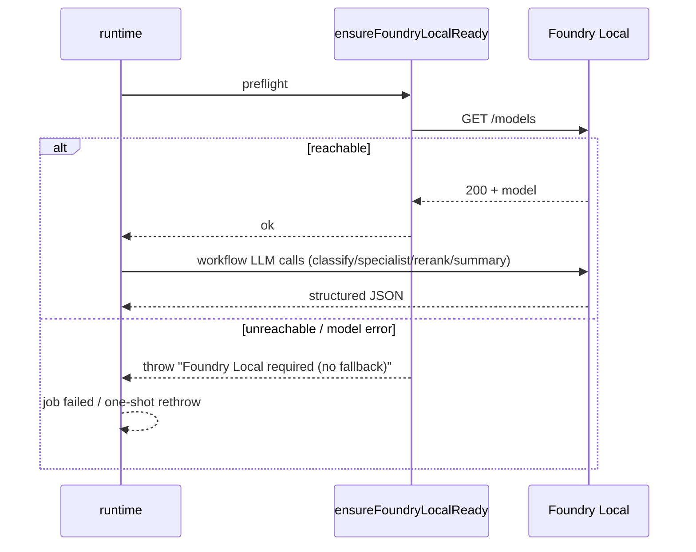

# TW-CLI — Architecture

TW-CLI (`twc`) is a TeamViewer troubleshooting CLI. It gathers **real** diagnostic
evidence from the host and the TeamViewer infrastructure, then orchestrates a team
of **Mastra agents** running on **Foundry Local** to classify the issue, propose
ranked root causes, and produce a remediation plan.

> **Hard policy:** every agent runs **only** on Foundry Local. There is **no
> heuristic/deterministic fallback** for the LLM work. If Foundry Local is not
> reachable, or a model call persistently fails, the run **fails fast** with an
> actionable error. See [No-Fallback Policy](#no-fallback-policy).

---

## 1. High-level overview



Two execution paths share the same engine:

- **Async jobs** — `twc troubleshoot|debug` creates a job, spawns a **detached
  worker** ([src/jobs/dispatch.ts](src/jobs/dispatch.ts)) that runs the workflow and
  persists the result. Inspect with `twc jobs list|show`.
- **One-shot** — `twc -p "..."` and the REPL run the same workflow **in-process**
  ([src/oneShot.ts](src/oneShot.ts)) and render immediately.

Both paths call the **same** `runMastraAgent` adapter, so behavior and the
Foundry-Local requirement are identical.

---

## 2. Components

| Layer | Path | Responsibility |
|---|---|---|
| CLI / REPL | [src/cli.ts](src/cli.ts), [src/repl.ts](src/repl.ts) | Arg parsing, commands, interactive shell |
| One-shot | [src/oneShot.ts](src/oneShot.ts) | In-process synchronous run + render |
| Job store | [src/jobs/jobStore.ts](src/jobs/jobStore.ts) | Persist jobs to `.twc-data/jobs.json` (lock-guarded) |
| Dispatch | [src/jobs/dispatch.ts](src/jobs/dispatch.ts) | Spawn detached worker process |
| Worker | [src/worker.ts](src/worker.ts), [src/workerCore.ts](src/workerCore.ts) | Run workflow for a job, write status/report |
| Adapter | [src/agents/mastraAdapter.ts](src/agents/mastraAdapter.ts) | Entry to the Mastra runtime + workflow timeout |
| Runtime | [src/mastra/runtime.ts](src/mastra/runtime.ts) | **Foundry Local preflight** + workflow `createRun` |
| Mastra instance | [src/mastra/index.ts](src/mastra/index.ts) | Registers agents, workflow, logger |
| Agents | [src/mastra/agents/index.ts](src/mastra/agents/index.ts) | 5 `Agent` definitions + lazy model resolver |
| Tools | [src/mastra/tools/specialistTools.ts](src/mastra/tools/specialistTools.ts) | `createTool` wrappers that run real probes |
| Workflow | [src/mastra/workflows/teamviewerTroubleshootWorkflow.ts](src/mastra/workflows/teamviewerTroubleshootWorkflow.ts) | classify → parallel specialists → aggregate |
| Foundry Local | [src/mastra/foundryLocal.ts](src/mastra/foundryLocal.ts) | Endpoint discovery, probe, **readiness gate** |
| LLM JSON | [src/mastra/util/llmJson.ts](src/mastra/util/llmJson.ts) | Tolerant JSON parse, retry, **throw-on-failure** |
| Probes | [src/probes/](src/probes) | Real DNS/TCP/HTTPS, services, Web API, logs |
| Routing | [src/agents/routing.ts](src/agents/routing.ts) | Deterministic bucket **seed** + agent selection |
| Catalog | [src/catalog/teamviewerProducts.ts](src/catalog/teamviewerProducts.ts) | Supported TeamViewer products |

---

## 3. The Mastra agents

Defined in [src/mastra/agents/index.ts](src/mastra/agents/index.ts) as
`new Agent({ id, name, instructions, model, tools })`:

| Agent | id | Tool | Focus |
|---|---|---|---|
| `gatewayAgent` | `tw-gateway-agent` | — | Classify, route, rerank, summarize |
| `connectivityAgent` | `tw-connectivity-agent` | `connectivityTool` | VPN/DNS/firewall/routing/packet loss |
| `authPolicyAgent` | `tw-auth-policy-agent` | `authPolicyTool` | Auth/SSO/token/policy |
| `endpointHealthAgent` | `tw-endpoint-health-agent` | `endpointHealthTool` | Services, version, host resources |
| `logIntelligenceAgent` | `tw-log-intelligence-agent` | `logIntelligenceTool` | Repeating log failure signatures |

**Lazy model resolution.** The `model` field is a getter `() => resolveModel()`.
This keeps non-LLM commands (`products`, `jobs list`) importable when the runtime
is offline — but it does **not** weaken the policy: any command that actually runs
agents goes through the Foundry-Local preflight first and fails if it is down.
`resolveModel()` enforces an OpenAI-compatible provider on a **loopback-only**
endpoint and reads the active model id (`twc models use` / `FOUNDRY_LOCAL_MODEL`).

---

## 4. Tools and probes (real evidence, not mocks)

Each specialist tool is a `createTool` with Zod `inputSchema`/`outputSchema` whose
`execute` runs a real probe:

| Tool | Probe | What it really does |
|---|---|---|
| `connectivityTool` | [connectivity.ts](src/probes/connectivity.ts) | DNS resolve + TCP 5938 socket + HTTPS to `webapi.teamviewer.com` |
| `endpointHealthTool` | [endpointHealth.ts](src/probes/endpointHealth.ts) | `Get-Service`, processes, registry/`teamviewer --info` (Win/Linux/macOS) |
| `authPolicyTool` | [authPolicy.ts](src/probes/authPolicy.ts) | TeamViewer Web API `/ping`, `/account`, `/devices` (needs `TEAMVIEWER_API_TOKEN`) |
| `logIntelligenceTool` | [logs.ts](src/probes/logs.ts) | Reads real TeamViewer log files and clusters error/warning signatures |

Probes produce **baseline evidence** deterministically; the LLM then **enriches**
(prioritizes hypotheses, adds root causes/actions). Probes are diagnostics, not an
LLM fallback — a probe error is captured as evidence, while an LLM failure aborts.

---

## 5. Workflow

[teamviewerTroubleshootWorkflow.ts](src/mastra/workflows/teamviewerTroubleshootWorkflow.ts):
`classifyStep → parallel(connectivity, auth-policy, endpoint-health, log-intelligence) → aggregateStep`.

1. **classify-and-plan** — `gatewayAgent` (LLM, **mandatory**) classifies the issue
   into buckets and seeds hypotheses. Deterministic `inferIssueBuckets` is merged in
   as a **seed only** (union with the model output), never as a replacement.
2. **specialists (parallel)** — each active specialist runs its probe for baseline
   evidence, then its agent (LLM, **mandatory**) enriches. Inactive buckets are
   `skipped`. A persistent LLM failure **throws**.
3. **aggregate-report** — merges branches, the `gatewayAgent` **reranks** root cause
   scores and writes the one-line **summary** (both LLM, **mandatory**), then
   computes confidence and the escalation decision. Returns a `WorkflowReport`.

---

## 6. No-Fallback Policy

This is the defining constraint of the system.

- **Preflight gate** — `ensureFoundryLocalReady()`
  ([foundryLocal.ts](src/mastra/foundryLocal.ts)) runs at the start of every workflow
  via [runtime.ts](src/mastra/runtime.ts). It verifies a loopback endpoint is
  configured and the service answers `/models`. Otherwise it throws an actionable
  error and the run stops.
- **No silent degradation** — `generateStructured`
  ([llmJson.ts](src/mastra/util/llmJson.ts)) makes `fallback` optional; in the agent
  path it is **omitted**, so after retries a failure **throws** instead of returning
  heuristic output. The classify/specialist/rerank/summary steps no longer swallow
  errors.
- **No remote agents** — `MASTRA_AGENT_ENDPOINT` is rejected by design; only the
  local Mastra runtime on Foundry Local is allowed.
- **Failure surfaces cleanly** — the worker marks the job `failed` with the error
  message; the one-shot path rethrows. Users get a clear "Foundry Local required"
  message rather than a low-quality heuristic answer.



---

## 7. Job lifecycle

```
queued → running → completed | failed
```

- `jobStore` persists to `.twc-data/jobs.json` with a lock dir to avoid races.
- `dispatch.startDetachedWorker` spawns `dist/worker.js` (or `--worker` in packaged
  mode) detached, logging to `.twc-data/<jobId>.log`.
- `workerCore.runWorkerJob` runs the workflow and writes `report` + rendered output,
  or `failed` + error.

---

## 8. Configuration (env)

| Var | Purpose |
|---|---|
| `FOUNDRY_LOCAL_ENDPOINT` | Loopback OpenAI-compatible endpoint (else auto-discovered via `foundry service status`) |
| `FOUNDRY_LOCAL_MODEL` | Default model id (prefer `twc models use <id>`) |
| `FOUNDRY_LOCAL_API_KEY` | Local key (placeholder allowed; warns once) |
| `TEAMVIEWER_API_TOKEN` | Optional — enables live auth/policy Web API probe |
| `TWC_WORKFLOW_TIMEOUT_MS` | Workflow timeout (default 120000) |
| `TWC_HOME` | Portable data dir (jobs/logs/config/history) |

Build: `npm run build`. Tests: `npx vitest run`. See [README.md](README.md).
