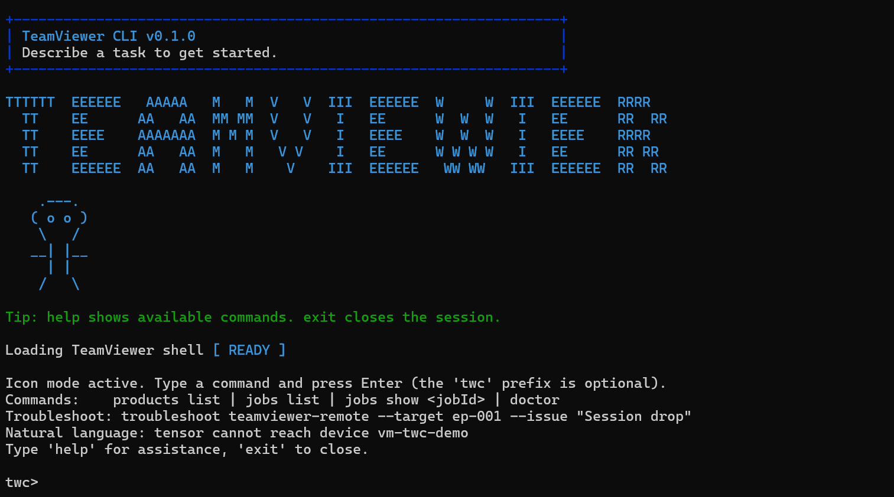

# TWC CLI (TeamViewer Command Line)



**Local-first, AI-assisted CLI for diagnosing and troubleshooting TeamViewer.**
Five Mastra agents run on Foundry Local (on-device, no cloud) against real probe evidence —
connectivity, endpoint health, logs, auth/policy — and produce a readable report with ranked
root causes, remediation steps, the exact log sources consulted, relevance-filtered Knowledge
Base articles, a confidence score and an escalation decision. Answers about TeamViewer features
are grounded against the official Knowledge Base via a local hybrid RAG index.

## Highlights

- **Local & private by design** — every LLM call is loopback-only Foundry Local. No telemetry,
  no cloud, no fallback.
- **Real probes, not canned data** — DNS / TCP `5938` / HTTPS, services & processes (Win/Linux/macOS),
  log clustering, optional TeamViewer Web API checks.
- **macOS standby/power-management correlation** — on macOS targets the log probe reads `pmset -g`
  and the `NetWatchdog` standby/wake events, so an "it drops every few minutes" symptom that is
  really *idle-sleep dropping the connection* is diagnosed correctly (and the post-wake
  RetryHandle/RCommand error burst is demoted to reconnection noise instead of being misattributed).
- **Readable, evidence-first reports** — a fixed section order (root causes → actions → knowledge
  base → log sources → evidence) keeps the decision content on top; speculative hypotheses appear
  only when no definitive cause was found.
- **Log-source transparency** — every report lists the exact log sources consulted on the target
  (file paths, the macOS unified-log `log show` command, etc.) with line/error/warning counts —
  works across local, SSH (Win/Linux/macOS), Azure VM and Kubernetes backends.
- **Grounded answers** — `docs ask` retrieves from a local LanceDB index of the official KB and
  verifies every sentence by embedding similarity. Troubleshoot reports cite only KB articles
  that pass an absolute on-topic relevance gate (no off-topic filler).
- **Non-blocking jobs** — every `debug`/`troubleshoot` runs as a detached worker with persisted
  logs, structured reports and a cancellable PID tree.
- **Modern terminal UX** — REPL + one-shot + free-text natural language; slash commands;
  Markdown reports ready to paste into a ticket.

## Quick start

```powershell
npm install
npm run build

# Pick (or install) a local model — see "Selecting an LLM model" below
foundry model run qwen2.5-1.5b-instruct-generic-cpu:4
twc models use qwen2.5-1.5b-cpu

# Try it:
twc                                                # interactive REPL
twc "tensor session drops on vm-twc-demo"          # free-text troubleshoot
twc docs ask "which ports does teamviewer use"     # grounded answer from local KB
twc doctor                                         # verify Foundry Local is reachable
```

## Command cheat sheet

The `twc` prefix is optional inside the interactive shell. Run `twc --help` or `twc <command> --help` for full option details.

| Command | What it does | Example |
|---|---|---|
| `twc` | Open the interactive REPL (banner + slash commands) | `twc` |
| `twc chat [--product <key>]` | Open the REPL with a preset product | `twc chat --product teamviewer-tensor` |
| `twc "<free text>"` | Troubleshoot from a natural-language sentence (auto-detects product/target) | `twc "tensor session drops on vm-twc-demo"` |
| `twc -p "<issue>" [--product <key>] [--target <v>] [--task <t>] [--context <c>] [--model <id>] [--markdown] [--capture <minutes>]` | One-shot synchronous run. `--capture <minutes>` live-streams the target's logs during the run (macOS only) so an *intermittent* failure can be reproduced and diagnosed from the real event rather than a stale snapshot. | `twc -p "Session drops" --product teamviewer-remote --target endpoint-001 --markdown` |
| `twc products list` | List the whitelisted TeamViewer products | `twc products list` |
| `twc agents list` | List the Mastra agent roles | `twc agents list` |
| `twc agents plan --task <t> --issue "<text>"` | Show which agents would be selected (dry run) | `twc agents plan --task troubleshoot --issue "policy not applied"` |
| `twc debug <product> --target <v> --issue "<text>" [--context <c>] [--wait] [--user <u> [--port N] [--key <path>]]` | Run a background **debug** job. With `--user`, all probes execute on `<target>` via SSH instead of locally. | `twc debug teamviewer-remote --target endpoint-001 --issue "crash on start" --wait` |
| `twc troubleshoot <product> --target <v> --issue "<text>" [--context <c>] [--wait] [--user <u> [--port N] [--key <path>]]` | Run a background **troubleshoot** job. Supports four target backends: local, SSH (Linux/macOS/Windows), Azure RunCommand (`azure-vm://rg/name`, no inbound port required), Kubernetes (`k8s://ns/pod[?container=X]`). | `twc troubleshoot teamviewer-remote --target azure-vm://my-rg/my-vm --issue "daemon not connecting" --wait` |
| `twc probe <target> [--port N] [--timeout ms] [--no-dns]` | Raw DNS + TCP connect probe (default port 5938 = TeamViewer daemon). No LLM. | `twc probe router1.teamviewer.com --port 5938` |
| `twc inspect-remote <target> --user <u> [--port 22] [--key <path>] [--json]` | SSH into a remote macOS host and collect TeamViewer diagnostics (version, daemon, logs, cloud reachability). Read-only, no LLM. | `twc inspect-remote XXX.XXX.XXX.XXX --user <user>` |
| `twc jobs list [--limit N]` | List recent background jobs | `twc jobs list --limit 10` |
| `twc jobs show [jobId] [--json\|--markdown]` | Show a job report (no id = last queued job) | `twc jobs show --markdown` |
| `twc jobs logs [jobId] [--tail N]` | Tail a job's worker log (no id = last queued job) | `twc jobs logs --tail 100` |
| `twc jobs cancel <jobId>` | Kill a running or queued job | `twc jobs cancel 7f3a2b` |
| `twc explain <jobId>` | Turn a job report into a plain-language narrative | `twc explain 7f3a2b` |
| `twc docs ask "<question>"` | Answer a TeamViewer question from official docs | `twc docs ask "which ports does teamviewer use"` |
| `twc docs reindex` | Crawl the entire TeamViewer KB and rebuild the local index | `twc docs reindex` |
| `twc docs refresh` | Incrementally add only KB pages not already indexed | `twc docs refresh` |
| `twc docs index` | Show local index status (chunks, embeddings, model) | `twc docs index` |
| `twc docs map [--rebuild]` | Build/show the KB URL map used for live lookups | `twc docs map --rebuild` |
| `twc docs sources` | List the official documentation sources | `twc docs sources` |
| `twc docs sync` | Pre-fetch & cache all official docs for offline use | `twc docs sync` |
| `twc models list\|use <id>\|current\|unset` | Manage the active Foundry Local model | `twc models use qwen2.5-1.5b-cpu` |
| `twc doctor` | Diagnose Foundry Local runtime, env vars and data dirs | `twc doctor` |
| `twc config` | Print the resolved configuration | `twc config` |

### Worked examples

```powershell
# Natural language — product (Tensor) and target (vm-twc-demo) are auto-detected:
twc "tensor session drops on vm-twc-demo after 5 minutes"

# One-shot troubleshoot, Markdown report for a ticket:
twc -p "Session drops after 5 minutes" --product teamviewer-remote --target endpoint-001 --markdown

# Background troubleshoot job, wait and print the result inline:
twc troubleshoot teamviewer-tensor --target tenant-acme --issue "Policy rollout not applied" --wait

# Catch an INTERMITTENT drop: live-stream the Mac's unified log for 2 minutes and
# reproduce the disconnect during the window — the diagnosis runs on the captured event.
twc -p "TeamViewer drops every few minutes" --product teamviewer-remote --target XXX.XXX.XXX.XXX --user <user> --capture 2

# Remote troubleshoot: run every probe on a Mac/Linux host via SSH instead of locally.
# Requires passwordless SSH (key already in ~/.ssh/authorized_keys on the target).
twc troubleshoot teamviewer-remote --target XXX.XXX.XXX.XXX --user <user> --issue "daemon not connecting" --wait

# Remote troubleshoot on a WINDOWS host via OpenSSH Server (built-in on Windows 10+/Server 2019+).
# On the target: Add-WindowsCapability -Online -Name OpenSSH.Server~~~~0.0.1.0; Start-Service sshd.
twc troubleshoot teamviewer-remote --target win-host.contoso.com --user Administrator --issue "service not starting" --wait

# Azure VM via ARM RunCommand (no inbound port, no SSH, auth via `az login`).
# Works for both Linux and Windows Azure VMs; the OS is auto-detected from the VM record.
twc troubleshoot teamviewer-remote --target azure-vm://my-rg/my-vm --issue "client cannot reach router" --wait

# Kubernetes pod (Linux containers only; requires kubectl on PATH).
twc troubleshoot teamviewer-remote --target k8s://default/teamviewer-host-7c8?container=host --issue "agent crashloop" --wait

# Inspect the last job without remembering its id:
twc jobs show               # last job
twc jobs show --markdown    # last job as Markdown
twc jobs logs --tail 100    # tail the last job's worker log

# Ask the local docs and explain a finished report:
twc docs ask "which ports does teamviewer use"
twc explain <jobId>
```

## Target backends

The same `debug` / `troubleshoot` workflow can run on four different backends.
The backend is picked from the `--target` value (and `--user` for plain SSH):

| Target syntax | Backend | OS support | Prerequisites |
|---|---|---|---|
| `--target local-device` (default) | Local Node child_process | Windows / Linux / macOS | none |
| `--target <host-or-ip> --user <u> [--port N] [--key path]` *or* `--target ssh://<user>@<host>[:port]` | OpenSSH client (`ssh`) | Linux, macOS, Windows (OpenSSH Server + PowerShell) | passwordless key in target's `~/.ssh/authorized_keys` (or `%PROGRAMDATA%\ssh\administrators_authorized_keys` on Windows) |
| `--target azure-vm://<resource-group>/<vm-name>` | Azure ARM `az vm run-command invoke` | Linux + Windows Azure VMs | `az` CLI on PATH + active `az login`; no inbound port required on the VM |
| `--target k8s://<namespace>/<pod>[?container=<c>]` | `kubectl exec` | Linux containers | `kubectl` on PATH + a kubeconfig with `exec` permission on the pod |

All four backends implement the same `ExecutionContext` interface
(`src/runtime/execContext.ts`) so every probe behaves identically — only the
shell-transport differs.

## Supported TeamViewer products

- TeamViewer Remote (`teamviewer-remote`)
- TeamViewer Tensor (`teamviewer-tensor`)
- TeamViewer Frontline (`teamviewer-frontline`)
- TeamViewer Assist AR (`teamviewer-assist-ar`)
- TeamViewer Remote Management (`teamviewer-remote-management`)
- TeamViewer DEX (`teamviewer-dex`)

The whitelist is defined in [src/catalog/teamviewerProducts.ts](src/catalog/teamviewerProducts.ts).
Each product has its own diagnostic profile (delivery model, probe targets, expected hosts) —
see [docs/PROBES.md](docs/PROBES.md) for the full per-product probe coverage table.

## TWC CLI vs TeamViewerPS

[TeamViewerPS](https://github.com/teamviewer/TeamViewerPS) is the official PowerShell module
from TeamViewer. It is an **administration / automation** wrapper around the TeamViewer Web API
(user management, policies, SSO, Computers & Contacts) plus a few local utility cmdlets.

TWC CLI solves a **different problem**: AI-assisted, local-first **diagnostics and root-cause
troubleshooting**. The two are complementary.

| Dimension | TeamViewerPS | **TWC CLI (this project)** |
| --- | --- | --- |
| Primary purpose | Administer/provision accounts via Web API | **Diagnose & troubleshoot** TeamViewer issues |
| Intelligence | None — returns raw API objects | **Local LLM + 5 Mastra agents** with ranked root causes |
| Output | PowerShell objects | **Structured Markdown reports** (evidence-anchored) |
| Real diagnostic probes | No | **Yes** — connectivity, endpoint health, auth/policy, log clustering |
| Network dependency | Requires TeamViewer Web API token + cloud calls | **Works offline** for most probes; inference is **loopback-only** |
| Privacy | Sends data to TeamViewer cloud API | **100% on-device** LLM + built-in secret/PII redaction |
| Execution model | Synchronous cmdlets | **Non-blocking job model** with detached workers and per-job logs |
| UX | Cmdlets only | **REPL + one-shot + free-text + slash commands** |

**When to use TeamViewerPS instead:** for *managing* a TeamViewer account — creating users,
assigning policies/roles, configuring SSO, syncing Computers & Contacts. TWC CLI does **not**
provision or mutate account state. A natural workflow is: **TeamViewerPS to administer**, then
**TWC CLI to diagnose** when something breaks.

## Knowledge & official docs

The agents are grounded against TeamViewer's **official documentation** so they answer
accurately instead of hallucinating. A local hybrid RAG index (LanceDB + on-device ONNX
embeddings) is built once via `twc docs reindex` and is then queried fully offline. `docs ask`
runs on Foundry Local with **per-sentence grounding verification** — unsupported sentences are
dropped and only the chunks that grounded a sentence appear in `Sources:`.

See **[docs/KNOWLEDGE.md](docs/KNOWLEDGE.md)** for the full pipeline (Jina ingestion, hybrid
retrieval, just-in-time fallback, grounding, tuning env vars).

## Architecture

Mastra is the **core orchestrator**. Every job flows through a multi-step Mastra workflow that
calls real Mastra agents in parallel against Foundry Local:

```
[input] → classify-and-plan (gateway LLM)
        → parallel:
            specialist-connectivity     (connectivityAgent + tool)
            specialist-auth-policy      (authPolicyAgent + tool)
            specialist-endpoint-health  (endpointHealthAgent + tool)
            specialist-log-intelligence (logIntelligenceAgent + tool)
        → aggregate-report (gateway LLM rerank + summary)
        → [WorkflowReport]
```

Each specialist step runs a deterministic baseline probe first (resilient to LLM failure), then
calls its Mastra Agent with a sanitized prompt and a narrow JSON contract, and merges the two.

For the full architecture (component diagram, no-fallback policy, runtime flow) see
**[ARCHITECTURE.md](ARCHITECTURE.md)**.

### Report layout

Both the text and Markdown renderers emit the same fixed, decision-first section order so the
answer is readable at a glance:

1. **Summary / Target / Confidence** — one-line outcome, where the probes ran, confidence + escalation.
2. **Root Causes** — ranked, scored causes (or an honest "none identified" when probes can't conclude).
   LLM-proposed causes must be **evidence-anchored**: a candidate that shares no distinctive term
   with the collected probe/log evidence is dropped as speculation, so the report never invents a
   plausible-sounding cause (e.g. "Permissions Issue") that nothing actually observed supports.
   Probe-derived causes (real log signatures, failed connectivity checks) are always trusted. On
   macOS, recurring disconnects that line up with `NetWatchdog` standby events surface a dedicated
   *"macOS standby/sleep is dropping the idle connection"* root cause and demote the correlated
   RetryHandle signature to reconnection noise.
3. **Recommended Actions** — prioritized remediation steps with risk + rollback.
4. **Knowledge Base** — only the official KB articles that pass an absolute on-topic relevance
   gate, sorted by relevance (off-topic filler is dropped, not just down-ranked).
5. **Log Sources Consulted** — the exact log paths / commands inspected on the target (e.g. the
   macOS unified-log `log show` invocation) with line/error/warning counts.
6. **Evidence** — the raw probe findings backing the conclusions.
7. **Exploratory Leads** — shown **only** when no definitive root cause was found, clearly labelled
   as unverified so they never distract from a confirmed cause.

## Azure demo

A reproducible end-to-end demo where the CLI runs on your laptop and diagnoses a TeamViewer
Host daemon running on an Azure Ubuntu VM. One PowerShell script provisions the VM, installs
TeamViewer headless via cloud-init, and enrolls it. See **[docs/AZURE-DEMO.md](docs/AZURE-DEMO.md)**.

## Setup

```bash
npm install
npm run build
cp .env.example .env   # then edit endpoint/model/token as needed
```

The CLI auto-loads `.env` from the current directory, `~/.twc/.env`, the install directory, or
`$TWC_HOME/.env`, so a global install still finds its config.

## Running from PowerShell

```powershell
# Global command (link the built CLI as `twc` on your PATH):
npm run build
npm run link:global
twc --help

# Windows .exe launcher (native, requires Node.js installed on the machine):
npm run build:exe
.\bin\twc.exe --help
```

If you run `twc.exe` outside the project root, set `TWC_HOME` to the project path (for example
`C:\TW CLI`).

**Icon mode (double-click):** double-clicking `bin\twc.exe` with no arguments opens a persistent
console with a `twc>` prompt and the TeamViewer startup animation. To create a desktop icon:

```powershell
.\create-desktop-shortcut.ps1
```

To run `twc` as a plain command from any folder, add `C:\TW CLI\bin` to the Windows `PATH`.

## Interactive REPL

Open the REPL with `twc` (or `twc chat --product <key>` to preset a product). Inside the REPL:

| Command | Purpose |
|---|---|
| `<free text>` | describe an issue, runs the workflow synchronously |
| `/product <key>` | set the active TeamViewer product |
| `/target <value>` | set the target (default `local-device`); supports `ssh://`, `azure-vm://`, `k8s://` URLs |
| `/task <debug\|troubleshoot>` | switch task type |
| `/context <text>` | attach one-shot extra context |
| `/user <ssh-user>` | run probes on the current target via SSH (empty to clear) |
| `/port <number>` | SSH port (default 22; empty to reset) |
| `/key <path>` | SSH private-key path (empty to reset) |
| `/capture <minutes>` | live-stream the target's logs during the next run to catch an intermittent failure (macOS only; empty to disable) |
| `/products` | list whitelist |
| `/agents` | list Mastra agent roles |
| `/jobs [N]` | list recent background jobs |
| `/show <jobId>` | render a job report |
| `/explain <jobId>` | explain a job report in plain language |
| `/logs <jobId> [N]` | tail a job log |
| `/cancel <jobId>` | kill a running job |
| `/doctor` | Foundry Local health check |
| `/docs <question>` | ask the official-docs knowledge layer |
| `/model [id]` | show or switch the active model |
| `/models` | list the curated model catalog |
| `/clear`, `/help`, `/exit` | screen / help / leave |

### Natural-language input

You don't have to set flags. Describe the problem and the CLI infers the **product** and
**target** from your sentence (deterministic — no LLM required). Explicit `--product` /
`--target` always override the detection.

```powershell
twc "tensor cannot reach device vm-twc-demo"
# (detected product: TeamViewer Tensor; detected target: vm-twc-demo)
```

### Plain-language explanation

Turn any completed job's structured report into a phone-support-style narrative:

```powershell
twc explain <jobId>      # or  /explain <jobId>  inside the REPL
```

### Copy-paste remediation

When a fix maps to an OS-native command (e.g. a stopped service), the report includes a
ready-to-run **Suggested commands** block tailored to the host OS (`Start-Service` on Windows,
`systemctl enable --now` on Linux, `launchctl` on macOS).

## Selecting an LLM model

A curated catalog of Foundry Local models is available — switch at any time, no rebuild needed:

```powershell
twc models list                              # show catalog + currently active
twc models use qwen2.5-0.5b-cpu              # accept alias or full Foundry id
twc models use qwen2.5-7b-instruct-generic-gpu:1
twc models current                           # print active id
twc models unset                             # clear persisted choice (falls back to env)
```

Inside the REPL:

```
twc › /models
twc › /model
twc › /model qwen2.5-1.5b-cpu
```

One-shot override:

```powershell
twc -p "Session drops" --product teamviewer-remote --model qwen2.5-1.5b-cpu
```

Priority: persisted choice (`models use` / `/model`) > `FOUNDRY_LOCAL_MODEL` env var. To install
a model on the host: `foundry model run <id>`.

> **NPU note (Snapdragon / Copilot+ PCs):** on some Arm64 hosts the QNN/NPU execution provider
> stalls and `*-qnn-npu` chat models can hang indefinitely. If `docs ask` appears stuck, switch
> to a **CPU build** — `twc models use qwen2.5-0.5b-cpu` (tiny, ~2s/answer) or
> `twc models use qwen2.5-1.5b-cpu` (higher quality). CPU builds are NPU-independent and steady.

## Foundry Local-only LLM configuration

This project is configured for **local-only LLM execution**. Foundry Local is **free** and
runs entirely on your machine.

- Remote endpoints are disabled (`MASTRA_AGENT_ENDPOINT` must NOT be set).
- The Foundry Local endpoint must be loopback-only (`localhost`, `127.0.0.1`, or `::1`).
- The endpoint is **auto-discovered** via `foundry service status` when `FOUNDRY_LOCAL_ENDPOINT`
  is not set, so the dynamic port just works.
- Model config is **resolved lazily**: non-LLM commands (`products list`, `jobs list`, `doctor`,
  `config`) work even if Foundry Local is offline.
- All LLM prompts are sanitized (control chars, role markers, length cap) to mitigate prompt
  injection.

Recommended environment:

```powershell
# Leave FOUNDRY_LOCAL_ENDPOINT unset to auto-discover the (dynamic) port.
$env:FOUNDRY_LOCAL_MODEL = "qwen2.5-0.5b-instruct-generic-cpu:4"
$env:FOUNDRY_LOCAL_API_KEY = "local-dev-key"
```

Use `twc doctor` to verify the runtime is reachable and the model is loaded.

## Tests

```bash
npm test
```

## Further reading

- **[ARCHITECTURE.md](ARCHITECTURE.md)** — full component / runtime architecture, no-fallback policy.
- **[docs/KNOWLEDGE.md](docs/KNOWLEDGE.md)** — RAG pipeline, grounding, `docs ask` internals.
- **[docs/PROBES.md](docs/PROBES.md)** — per-product diagnostic probe coverage.
- **[docs/AZURE-DEMO.md](docs/AZURE-DEMO.md)** — laptop ↔ Azure VM end-to-end demo.
- **[docs/HARDENING.md](docs/HARDENING.md)** — production hardening table + recommended next steps.
- **[docs/mastra-agent-prompts.md](docs/mastra-agent-prompts.md)** — the actual agent prompts.
